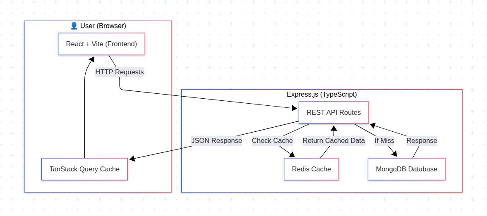

# MERN Blogs Frontend

A modern, full-stack blog application built with React, TypeScript, and Vite. Features a beautiful UI with HeroUI components, JWT authentication, and efficient caching strategies using TanStack Query for optimal performance and user experience.

## 🏗️ Architecture



## 🚀 Features

- **🔐 JWT Authentication**: Secure login system with HTTP-only cookies
- **🎨 Modern UI**: Beautiful interface with HeroUI components and Tailwind CSS
- **⚡ High Performance**: Built with React 18, TypeScript, and Vite
- **🔄 Smart Caching**: Advanced caching strategies with TanStack Query
- **📝 Markdown Support**: Rich blog content rendered with React Markdown
- **📱 Responsive Design**: Mobile-first responsive layout
- **🛡️ Type Safety**: Full TypeScript support for better development experience
- **🔒 Security**: HTTP-only cookies, CSRF protection, and secure authentication

## 🛠️ Tech Stack

- **Frontend Framework**: React 18
- **Build Tool**: Vite
- **Language**: TypeScript
- **Styling**: Tailwind CSS + HeroUI
- **Authentication**: JWT with HTTP-only cookies
- **HTTP Client**: Axios with interceptors
- **State Management**: TanStack Query (React Query)
- **Routing**: React Router DOM
- **Markdown**: React Markdown with GitHub Flavored Markdown
- **Code Quality**: ESLint + Prettier

## 📦 Installation

1. **Clone the repository**
   ```bash
   git clone <repository-url>
   cd blogs-ci-cd-fe
   ```

2. **Ensure Node.js v20 is installed**
   ```bash
   node --version
   ```
   This project requires Node.js v20 or higher. If you don't have it installed, download it from [nodejs.org](https://nodejs.org/).

3. **Install dependencies**
   ```bash
   npm install
   ```

4. **Start the development server**
   ```bash
   npm run dev
   ```

5. **Open your browser**
   Navigate to `http://localhost:5173`

## 🔐 Authentication

The application includes a complete authentication system:

### Test Credentials
- **Email**: user1@example.com
- **Password**: password123

### Features
- JWT token authentication with HTTP-only cookies
- Automatic token refresh handling
- Protected routes and API endpoints
- Secure logout functionality

## 🏗️ Project Structure

```
src/
├── components/          # Reusable UI components
│   ├── blog-card.tsx   # Blog card component
│   ├── primitives.ts   # UI primitives and utilities
│   ├── protected-route.tsx # Route protection component
│   └── unauthenticated-view.tsx # Unauthenticated user view
├── config/
│   └── site.ts         # Site configuration
├── contexts/
│   └── auth-context.tsx # Authentication context
├── layouts/
│   └── default.tsx     # Default layout component
├── lib/
│   └── api.ts          # Axios configuration with interceptors
├── pages/
│   ├── blog.tsx        # Blog listing page
│   ├── blog-item.tsx   # Individual blog post page
│   └── signin.tsx      # Sign-in page
├── services/
│   ├── auth.ts         # Authentication service
│   └── blog.ts         # Blog API service
├── provider.tsx        # App providers (Query Client, Auth, etc.)
├── styles/
│   └── globals.css     # Global styles
├── types/
│   └── index.ts        # TypeScript type definitions
├── utils/
│   └── constants.ts    # Application constants
├── App.tsx             # Main app component with routing
└── main.tsx           # Application entry point
```

## 🔄 Caching Strategy

This application uses **TanStack Query** (React Query) combined with **React Router** for efficient data caching and navigation.

### React Router Caching

The application implements route-based caching where data is cached per route and maintained during navigation:

```typescript
// Blog listing with caching
const { data: blogs, isLoading } = useQuery({
  queryKey: ["blog"],
  queryFn: () => fetch(`${API_URL}/blogs`).then(res => res.json()),
  staleTime: 1000 * 60 * 30, // 30 minutes
});

// Individual blog post with unique cache key
const { data: blogContent, isLoading } = useQuery({
  queryKey: ["blog", blogId],
  queryFn: () => fetch(`${API_URL}/blogs/${blogId}`).then(res => res.json()),
  staleTime: 1000 * 60 * 30, // 30 minutes
});
```

**Benefits:**
- Instant navigation between cached routes
- Background data updates
- Reduced API calls
- Improved user experience
- Automatic cache invalidation on authentication state changes

## 🔧 Development

### Available Scripts

```bash
# Start development server
npm run dev

# Build for production
npm run build

# Preview production build
npm run preview

# Lint and fix code
npm run lint
```

### Code Quality

The project uses ESLint with the following configuration:
- TypeScript support
- React best practices
- Accessibility guidelines (jsx-a11y)
- Import organization and sorting
- Unused imports detection
- Prettier integration for consistent formatting

## 🚀 Performance Optimizations

1. **Code Splitting**: Automatic code splitting with Vite
2. **Lazy Loading**: Components loaded on demand
3. **Image Optimization**: Optimized images with HeroUI Image component
4. **Bundle Analysis**: Built-in bundle analysis with Vite
5. **Smart Caching**: Multiple layers of caching with TanStack Query
6. **HTTP Interceptors**: Efficient API request/response handling
7. **Authentication Optimization**: JWT tokens cached in HTTP-only cookies

## 🚀 CI/CD Pipeline

The project includes automated GitHub Actions workflows for continuous integration and deployment:

### Build Process
- **Automated building** on every push and PR
- **Code linting** with ESLint
- **TypeScript compilation** checks
- **Build verification** to ensure deployability

### Deployment
- **GitHub Pages**: Automatic deployment on main/master branch
- **Zero configuration**: No additional secrets or setup required

```bash
# Manual deployment commands
npm run deploy        # Deploy to GitHub Pages
npm run build        # Build for production
npm run type-check   # TypeScript validation
```

See [DEPLOYMENT.md](./DEPLOYMENT.md) for detailed deployment instructions.

## 📱 Browser Support

- Chrome (latest)
- Firefox (latest)
- Safari (latest)
- Edge (latest)

---

**Happy Coding! 🎉**
